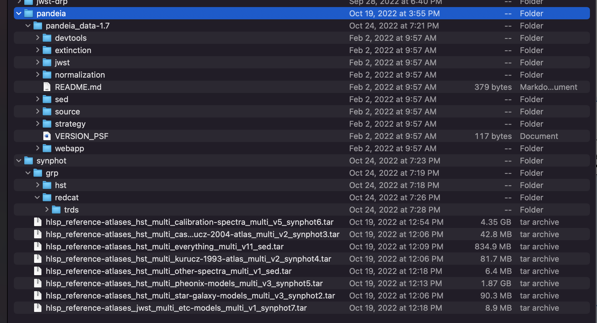
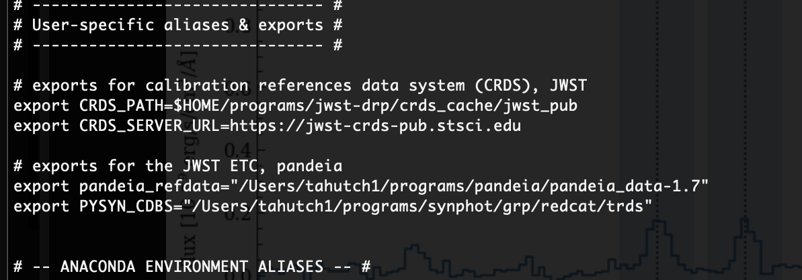

# pandeia_lensing

Modifications to Pandeia scripts to create simulated lensed galaxies as ETC sources 

### Notes on installing the `pandeia` JWST ETC
For anyone installing pandeia and trying to run the scripts and notebooks in this repo, make sure that you also download the reference data that pandeia needs (on the [installation page](https://jwst-docs.stsci.edu/jwst-exposure-time-calculator-overview/jwst-etc-pandeia-engine-tutorial/installing-pandeia), there's a pandeia tarball and then also the stsci reference atlases).  Below are some screenshots of how these data can be organized and how you should set up the exports to point to their locations in your `.zshrc` file (or the `.[shell]rc`; i.e., whatever type terminal shell you're using).

[Taylor] placed the pandeia tarball in a folder called `pandeia`, then placed all of the atlas tarballs in a folder called `synphot`:

The `grp` folder within the synphot one is created when you start to un-tar the various atlas tarballs -- the export path to these data need to point to the `trds` folder shown within that overarching `grp` folder.  Then set up your export paths like this:

(look at the `# exports for the JWST ETC, pandeia` section)

